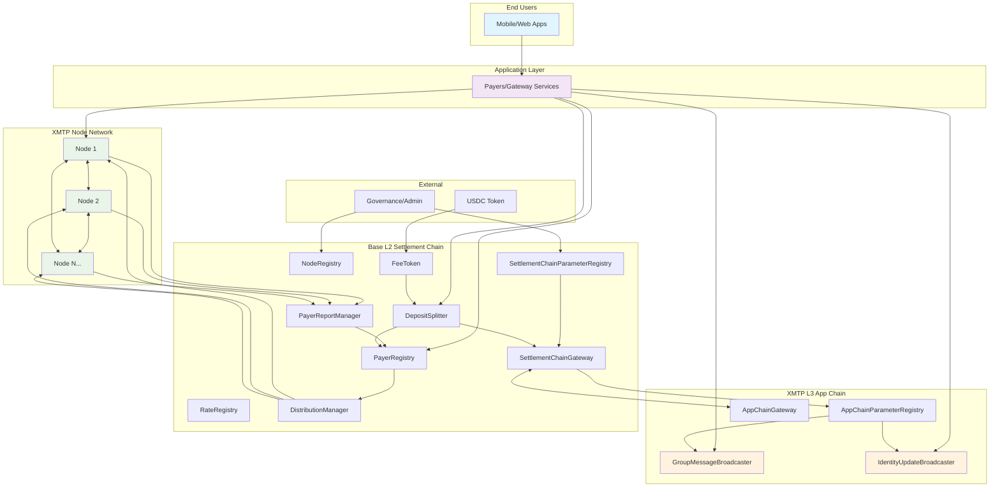
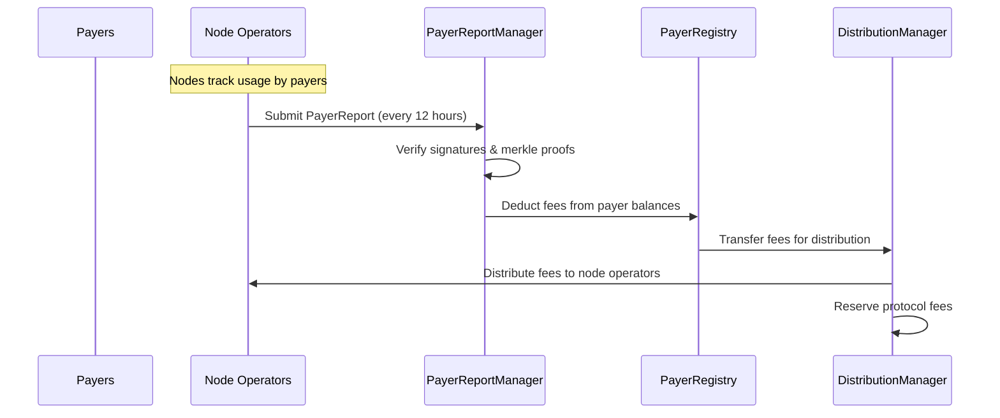
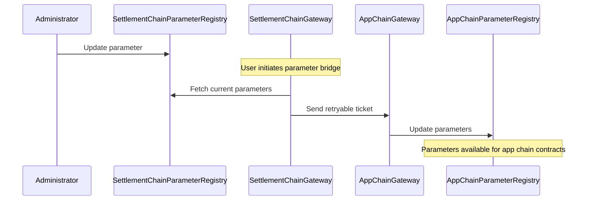

# XMTP Network System Architecture

> Last edited: 09/15/2025

- [XMTP Network System Architecture](#xmtp-network-system-architecture)
  - [System Overview](#system-overview)
  - [Messaging Protocol](#messaging-protocol)
  - [Chain Architecture](#chain-architecture)
    - [Settlement Chain (Base L2)](#settlement-chain-base-l2)
    - [Application Chain (XMTP L3)](#application-chain-xmtp-l3)
    - [Design Rationale](#design-rationale)
  - [Actors](#actors)
    - [End Users](#end-users)
    - [Payers](#payers)
    - [Node Operators](#node-operators)
    - [Administrators](#administrators)
  - [Economic Model](#economic-model)
    - [Fee Structure](#fee-structure)
    - [Settlement Process](#settlement-process)
    - [Token Economics](#token-economics)
  - [Cross-Chain Communication](#cross-chain-communication)
    - [Parameter Flow](#parameter-flow)
    - [Reliability Features](#reliability-features)
  - [Security Model](#security-model)
    - [Trust Assumptions](#trust-assumptions)
    - [Consensus Mechanism](#consensus-mechanism)
    - [Upgrade Security](#upgrade-security)

## System Overview

XMTP is a decentralized messaging protocol that enables secure, scalable communication through a multi-chain architecture. The system combines the security and economic finality of Layer 2 chains with the high throughput and low cost of Layer 3 chains to create an efficient messaging infrastructure.

## Messaging Protocol

The XMTP Network enables secure messaging through the [MLS (Messaging Layer Security)](https://en.wikipedia.org/wiki/Messaging_Layer_Security) standard, providing end-to-end encryption and forward secrecy for instant messaging applications.

The MLS standard defines 5 types of messages, with 2 types stored on-chain through [Broadcaster contracts](../src/abstract/PayloadBroadcaster.sol):

- **Group Messages**: Stored via GroupMessageBroadcaster for forced inclusion and censorship resistance
- **Identity Updates**: Stored via IdentityUpdateBroadcaster for identity management and key rotation

The remaining message types are published directly to `xmtpd` nodes for off-chain processing and delivery.

## Chain Architecture

The XMTP network employs a dual-chain architecture optimized for both economic security and messaging throughput. For detailed contract information, see the [system contracts document](./contracts.md).

### Settlement Chain (Base L2)

The settlement chain handles economic operations, governance, and system parameters:

- **Economic Functions**: Fee collection, node operator payments, payer account management
- **Governance**: System parameter management, node registry, upgrade coordination
- **Cross-Chain Coordination**: Parameter bridging to app chains via retryable tickets
- **Key Contracts**: NodeRegistry, PayerRegistry, RateRegistry, DistributionManager, FeeToken

### Application Chain (XMTP L3)

The application chain focuses on high-throughput message broadcasting:

- **Message Storage**: On-chain storage for group messages and identity updates
- **Low-Cost Operations**: Optimized for high-frequency messaging operations
- **Parameter Consumption**: Receives configuration from settlement chain
- **Key Contracts**: GroupMessageBroadcaster, IdentityUpdateBroadcaster, AppChainParameterRegistry

### Design Rationale

- **Cost Optimization**: Expensive economic operations on L2, cheap messaging on L3
- **Scalability**: L3 chains can be horizontally scaled as needed
- **Security**: Economic finality secured by L2, messaging availability on L3

## Actors

### End Users

End users are the ultimate consumers of XMTP messaging services, typically accessing the network through mobile applications, web interfaces, or other client applications. They send and receive MLS-encrypted messages without directly interacting with the blockchain infrastructure.

### Payers

Payers are service providers (typically companies with messaging applications) who fund network operations to serve their end users. They operate gateway services and maintain funded accounts to pay for messaging costs.

**Setup Requirements**:

- Deploy a [Gateway service](https://github.com/xmtp/xmtpd/tree/main/pkg/api/payer) with their private key
- Fund accounts in PayerRegistry for off-chain message costs
- Maintain xUSD balances on app chains for on-chain message costs

**Message Publishing**:

- **On-chain messages**: Published directly to broadcaster contracts (GroupMessageBroadcaster, IdentityUpdateBroadcaster)
- **Off-chain messages**: Published through xmtpd nodes, costs settled through PayerReports

### Node Operators

Node operators maintain the XMTP network infrastructure by running [xmtpd](https://github.com/xmtp/xmtpd) services that process messages, maintain network consensus, and earn fees for their services.

**xmtpd Service Components**:

- **Message APIs**: Interfaces for payers to publish and retrieve MLS messages
- **Node Registry**: Maintains connections with other canonical network nodes
- **Cross-Chain Indexer**: Monitors events on both settlement and application chains

**Onboarding Process**:

1. **NFT Minting**: Protocol administrator mints a NodeRegistry NFT
2. **Canonical Network Addition**: Administrator enables the node for the canonical network
3. **Service Configuration**: Node operator configures xmtpd with their private key
4. **Network Synchronization**: Node connects to and synchronizes with other canonical nodes

### Administrators

Administrators manage system governance, parameters, and network operations through multi-signature wallets and eventual governance mechanisms.

**Responsibilities**:

- **Parameter Management**: Update system parameters via SettlementChainParameterRegistry
- **Node Management**: Add/remove nodes from the canonical network
- **Upgrade Coordination**: Manage contract upgrades and migrations
- **Economic Policy**: Set fee rates, distribution parameters, and protocol policies

## Economic Model

The XMTP network operates on a fee-based economic model where payers fund operations and node operators earn rewards for providing services.

### Fee Structure

- **On-chain Messages**: Direct gas costs paid upfront by payers on the app chain
- **Off-chain Messages**: Usage-based fees settled periodically through PayerReports
- **Protocol Fees**: Percentage of total fees reserved for protocol treasury

### Settlement Process

### Token Economics

- **FeeToken (xUSD)**: ERC20 token backed 1:1 by USDC for network fees
- **Deposit Mechanisms**: Direct deposits or DepositSplitter for cross-chain funding
- **Withdrawal Locks**: Time-delayed withdrawals for security

## Cross-Chain Communication

Parameter synchronization between settlement and app chains uses Arbitrum's retryable ticket mechanism.

### Parameter Flow

### Reliability Features

- **Guaranteed Delivery**: Retryable tickets ensure parameter updates reach app chains
- **Nonce Tracking**: Prevents out-of-order parameter updates
- **Failure Recovery**: Failed tickets can be retried

## Security Model

### Trust Assumptions

- **Node Operators**: Trusted to process messages honestly and submit accurate reports
- **Administrators**: Multi-sig controlled parameter updates and governance
- **Cross-Chain Security**: Relies on Arbitrum's L2→L3 security guarantees

### Consensus Mechanism

- **Canonical Network**: Subset of registered nodes designated as canonical
- **Message Consistency**: Nodes subscribe to each other for consistent message views
- **Report Validation**: Multiple nodes must agree on PayerReports before settlement

### Upgrade Security

- **Migratable Pattern**: External migratable contracts enable secure upgrades
- **Access Control**: Admin-controlled upgrade authorization
