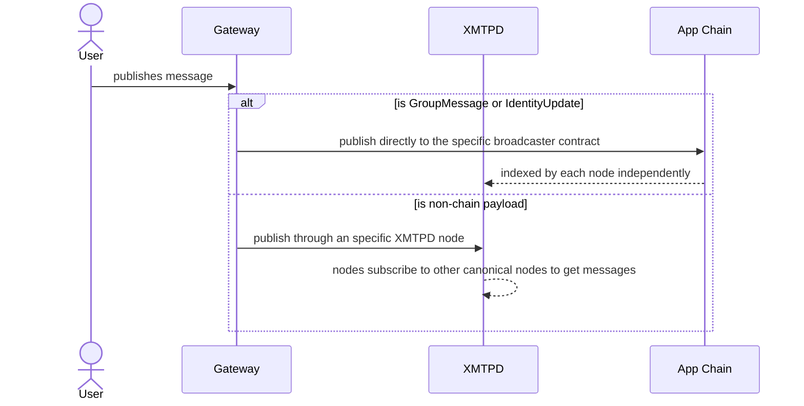

# XMTP Network System Architecture

> Last edited: 09/15/2025

- [XMTP Network System Architecture](#xmtp-network-system-architecture)
  - [Messaging protocol](#messaging-protocol)
  - [Chains](#chains)
  - [Actors](#actors)
    - [Node Operators](#node-operators)
    - [Payers](#payers)

## Messaging protocol

The XMTP Network allows users to read and write [MLS](https://en.wikipedia.org/wiki/Messaging_Layer_Security) messages, enabling instant-messaging applications to use this secure standard on their communications.

The MLS standard defines 5 types of messages and 2 of them are currently stored in the blockchain through the [Broadcaster contracts](../src/abstract/PayloadBroadcaster.sol): **group messages** and **identity updates**.
The rest of messages are published directly to `xmtpd` nodes.

## Chains

The network is composed by two chains. A deeper view of this separation can be read in the [system contracts document](./codoc/architecture.md ntracts.md):

- **Application chain** is a L3 based on Arbitrum Orbit that stores the [GroupMessageBroadcaster](../src/app-chain/GroupMessageBroadcaster.sol) and the [IdentityUpdateBroadcaster](../src/app-chain/IdentityUpdateBroadcaster.sol) contracts.
- **Settlement chain** where the governance contracts are deployed.

## Actors

### Node Operators

The XMTP Network is powered by a set of trusted **Node Operators** running the [xmtpd](https://github.com/xmtp/xmtpd) service.

`xmtpd` is a Golang daemon that is composed by different services:

- APIs to read and write MLS messages. Used by payers.
- A registry of other `xmtpd` nodes **part of the canonical network**:
  - Each node subscribe to each other canonical node messages, so the system reaches an identical view of the network for every node.
- A cross-chain indexer that listens to:
  - New group messages and identity updates events on the app chain.
  - Payer related events on the settlement chain.

**On-boarding** a Node Operator requires:

- A protocol administrator to mint a NFT in the [NodeRegistry](../src/settlement-chain/NodeRegistry.sol), which allows the Node Operator to instruct the `xmtpd` service to use their specific private key to authenticate into the network.
- The administrator enables a subset of Node Operators NFT to be the canonical XMTP network. This is controlled by the specific functions in `NodeRegistry.sol`.

### Payers

Payers are 3rd parties interested in publishing messages to the network. Usually they are companies with their own instant-messaging applications, offering the service to end users.

In order to publish messages they set up:

- A [Gateway](https://github.com/xmtp/xmtpd/tree/main/pkg/api/payer) service, configured with their own private key, which allows publishing messages to `xmtpd` nodes from an specific application.
- Fund a payer account in the [PayerRegistry](../src/settlement-chain/PayerRegistry.sol), where non-chain messages costs will be deducted in future PayerReports, if applicable.

Publishing messages works in two ways, depending on the payload to be published:

- Non chain messages will be published to an specific `xmtpd` node, which can be defined as the `target originator`. The payer signature is gathered by the `xmtpd` node to calculate and settle the messaging costs.
- Group messages and identity updates are published directly into the respective contract, and indexed by all the `xmtpd` nodes.

Because of this strategy to publish messages, there are two ways of charging costs to specific payers:

- Direct gas cost of publishing a message to the app chain, which is paid up-front by the transaction signer running the `gateway` service.
- Cost of publishing non-chain messages The `xmtpd` nodes store internally the amount of messages published by different payers (identified by their signatures) and group them into payer reports, which are broadcasted to other nodes, approved and finally submitted to the settlement chain every 12 hours to the [PayerReportManager](../src/settlement-chain/PayerReportManager.sol) contract.
