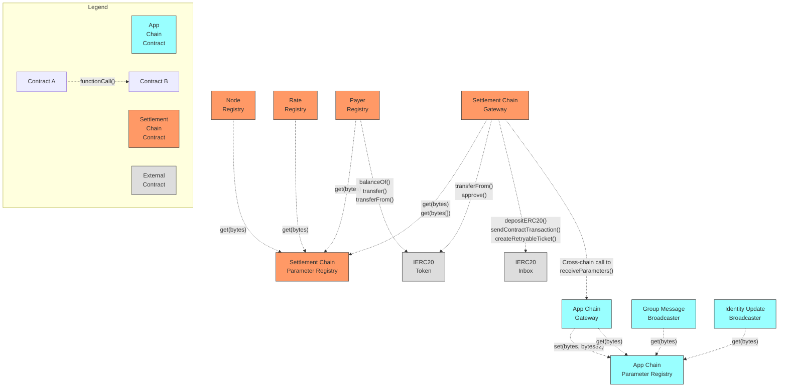

# XMTP Smart Contracts - Communication Dependency Diagram

This diagram illustrates the communication dependencies between contracts in the XMTP smart contracts ecosystem, focusing exclusively on which contracts call functions on other contracts (not inheritance).

## Contract Communication Diagram

## Key Communication Dependencies

### Settlement Chain Contracts

1. **Settlement Chain Gateway**:

    - Calls `get(bytes)` on **Settlement Chain Parameter Registry** to retrieve a migrator address
    - Calls `get(bytes[])` on **Settlement Chain Parameter Registry** to retrieve parameter values for bridging
    - Calls `depositERC20()`, `sendContractTransaction()`, and `createRetryableTicket()` on **IERC20 Inbox** for cross-chain messaging
    - Calls `transferFrom()`, and `approve()` on **IERC20 Token** for token operations
    - Prepares cross-chain calls to **App Chain Gateway**'s `receiveParameters()` function via retryable tickets

2. **Node Registry**:

    - Calls `get(bytes)` on **Settlement Chain Parameter Registry** to retrieve admin, node manager, and migrator addresses

3. **Payer Registry**:

    - Calls `get(bytes)` on **Settlement Chain Parameter Registry** to retrieve settler, fee distributor, minimum deposit, withdraw lock period, and a migrator address
    - Calls `balanceOf()`, `transfer()`, and `transferFrom()` on **IERC20 Token** for token operations

4. **Rate Registry**:

    - Calls `get(bytes)` on **Settlement Chain Parameter Registry** to retrieve message fee, storage fee, congestion fee, target rate per minute, and a migrator address

### App Chain Contracts

1. **App Chain Gateway**:

    - Calls `set(bytes, bytes32)` on **App Chain Parameter Registry** to store parameters received from settlement chain
    - Calls `get(bytes)` on **App Chain Parameter Registry** to retrieve a migrator address

2. **Group Message Broadcaster**:

    - Calls `get(bytes)` on **App Chain Parameter Registry** to retrieve min/max payload sizes, pause status, and a migrator address

3. **Identity Update Broadcaster**:

    - Calls `get(bytes)` on **App Chain Parameter Registry** to retrieve min/max payload sizes, pause status, and a migrator address

## Primary Communication Flows

1. **Parameter Bridging Flow**:

    - Settlement Chain Gateway reads parameters from Settlement Chain Parameter Registry
    - Settlement Chain Gateway sends parameters to App Chain Gateway via retryable tickets
    - App Chain Gateway receives parameters and updates App Chain Parameter Registry
    - App chain contracts read parameters from App Chain Parameter Registry

2. **Token Operations Flow**:

    - Payer Registry interacts with IERC20 token for deposits and withdrawals
    - Settlement Chain Gateway uses IERC20 Inbox for cross-chain messaging

3. **Configuration Access Pattern**:
    - All contracts retrieve their configuration from their respective chain's parameter registry
    - This creates a consistent pattern where contract behavior is determined by centrally managed parameters
