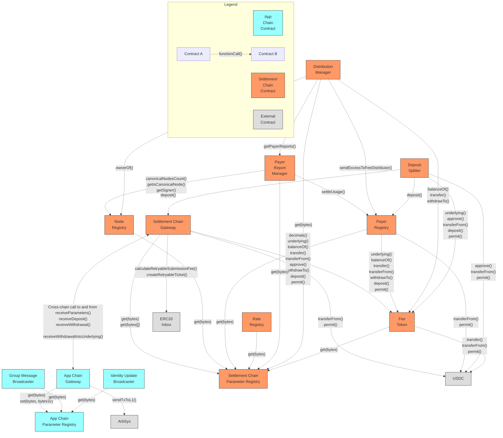

# XMTP Smart Contracts - Communication Dependency Diagram

This diagram illustrates the communication dependencies between contracts in the XMTP smart contracts ecosystem, focusing exclusively on which contracts call functions on other contracts (not inheritance).

## Contract Communication Diagram

## Key Communication Dependencies

### Settlement Chain Contracts

All settlement chain contracts interact with the settlement chain parameter registry to retrieve their configuration parameters.

- **Settlement Chain Gateway**:

  - Calls `get(bytes[])` on **Settlement Chain Parameter Registry** to retrieve parameter values for bridging
  - Calls `createRetryableTicket()` and `calculateRetryableSubmissionFee()` on **ERC20 Inbox** for cross-chain messaging
  - Calls **FeeToken** and **USDC** for token operations
  - Prepares cross-chain deposits to **App Chain Gateway**'s `receiveDeposit()` function via retryable tickets
  - Prepares cross-chain calls to **App Chain Gateway**'s `receiveParameters()` function via retryable tickets

- **Payer Registry**:

  - Calls **FeeToken** and **USDC** for token operations

- **PayerReportManager**:

  - Calls `getIsCanonicalNode()`, `canonicalNodesCount()`, and `getSigner()` on **NodeRegistry** to retrieve canonical node information
  - Calls `settleUsage()` on **PayerRegistry** to settle usage for batches of payer fees

- **DistributionManager**:

  - Calls **FeeToken** for token operations
  - Calls `ownerOf()` on **NodeRegistry** to verify node ownership
  - Calls `sendExcessToFeeDistributor()` on **PayerRegistry** to trigger the **PayerRegistry** to send it its excess fee tokens
  - Calls `getPayerReports()` on **PayerReportManager** to retrieve payer report state information

- **DepositSplitter**:

  - Calls **FeeToken** and **USDC** for token operations
  - Calls `deposit()` on **PayerRegistry** to deposit fee tokens into the **PayerRegistry**
  - Calls `deposit()` on **SettlementChainGateway** to deposit fee tokens into the **SettlementChainGateway**

- **FeeToken**:

  - Calls **USDC** for token wrapping operations

### App Chain Contracts

All app chain contracts interact with the app chain parameter registry to retrieve their configuration parameters.

- **App Chain Gateway**:

  - Calls `set(bytes, bytes32)` on **App Chain Parameter Registry** to store parameters received from settlement chain

## Primary Communication Flows

- **Parameter Bridging Flow**:

  - Settlement Chain Gateway reads parameters from Settlement Chain Parameter Registry
  - Settlement Chain Gateway sends parameters to App Chain Gateway via retryable tickets
  - App Chain Gateway receives parameters and updates App Chain Parameter Registry
  - App chain contracts read parameters from App Chain Parameter Registry

- **Token Operations Flow**:

  - Payer Registry interacts with FeeToken and USDC for deposits and withdrawals
  - Settlement Chain Gateway interacts with FeeToken and USDC for deposits and withdrawals
  - DepositSplitter interacts with FeeToken and USDC to pull tokens from users, but only transfers FeeToken to the PayerRegistry
  - DistributionManager interacts with FeeToken and USDC for withdrawals
  - PayerRegistry interacts with FeeToken and USDC for deposits, withdrawals, but only transfers FeeToken to the DistributionManager

- **Configuration Access Pattern**:
  - All contracts retrieve their configuration from their respective chain's parameter registry
  - This creates a consistent pattern where contract behavior is determined by centrally managed parameters
