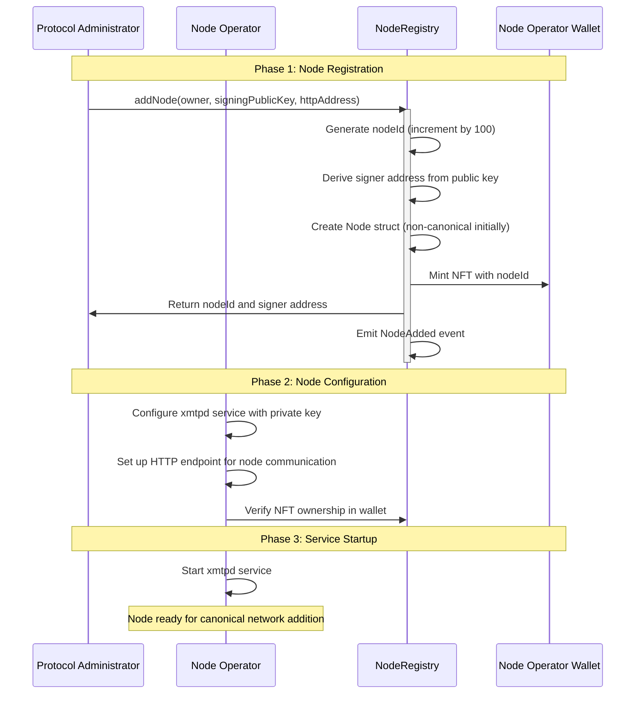
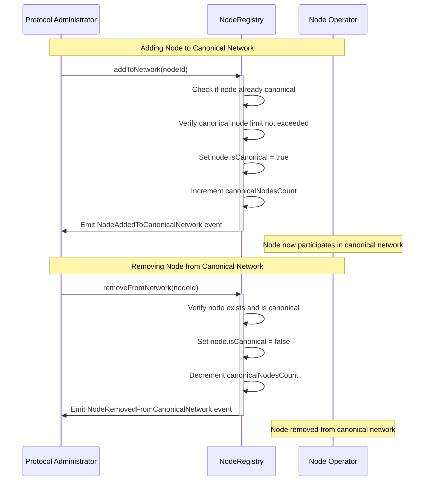
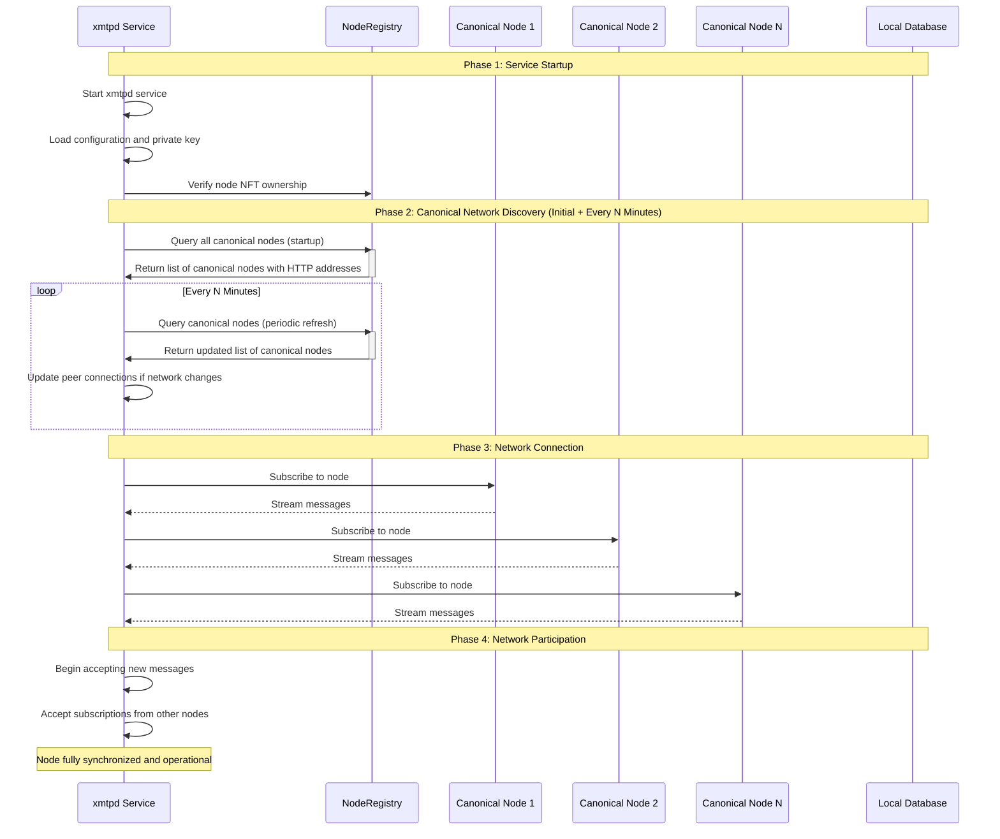

# XMTP node operators

- [XMTP node operators](#xmtp-node-operators)
  - [Node identification system](#node-identification-system)
  - [Canonical network](#canonical-network)
  - [Node onboarding process](#node-onboarding-process)
  - [Canonical network management](#canonical-network-management)
  - [Node synchronization process](#node-synchronization-process)
  - [Key features](#key-features)
    - [Node authentication](#node-authentication)
    - [Network consensus](#network-consensus)
    - [Operational management](#operational-management)

Node operators are managed through the [Node Registry](../src/settlement-chain/NodeRegistry.sol) contract, where they are registered as NFTs representing their node ownership and operational rights.

The node operator configures the `xmtpd` service to use the wallet private key holding the NFT, authenticating the node during startup and network operations.

## Node identification system

The `NodeRegistry` mints NFTs starting at ID 100, increasing by 100 for each new NFT minted. This ID serves as the unique node identifier, and each message published to a specific node is identified with the tuple `[originator_id, sequence_id]`, where:

- `originator_id` is the NFT ID (100, 200, 300, etc.)
- `sequence_id` is a monotonically increasing counter

This system guarantees that any message published to the network is unique and easily traceable.

## Canonical network

While there are no limitations on the total number of node operators that can exist, only a maximum of approximately 20-25 nodes participate in the `canonical network` at any given time for performance reasons. This limit is enforced by the protocol administrator through the `maxCanonicalNodes` parameter in the `NodeRegistry`.

The protocol administrator can add or remove specific nodes from the canonical network using the `addToNetwork` and `removeFromNetwork` functions.

## Node onboarding process

The onboarding process involves minting a new node NFT and registering the node operator with the XMTP Broadcast Network:

## Canonical network management

Administrators manage which nodes participate in the canonical network through dedicated functions:

## Node synchronization process

When an `xmtpd` service starts up, it follows a systematic process to synchronize with the canonical network:

## Key features

### Node authentication

- **NFT-based identity**: Node operators authenticate using the private key associated with their NFT
- **Public key registration**: Signing public keys are registered onchain for message verification
- **HTTP endpoints**: Nodes maintain HTTP addresses for peer-to-peer communication

### Network consensus

- **Canonical subset**: Only canonical nodes participate in core network consensus
- **Message consistency**: All canonical nodes maintain identical views of the message history
- **Peer synchronization**: Nodes subscribe to each other's message feeds for consistency

### Operational management

- **Dynamic network**: Nodes can be added or removed from the canonical network without service interruption
- **Performance optimization**: Limited canonical network size ensures optimal performance
- **Monitoring**: Node operators can update their HTTP addresses and service endpoints
