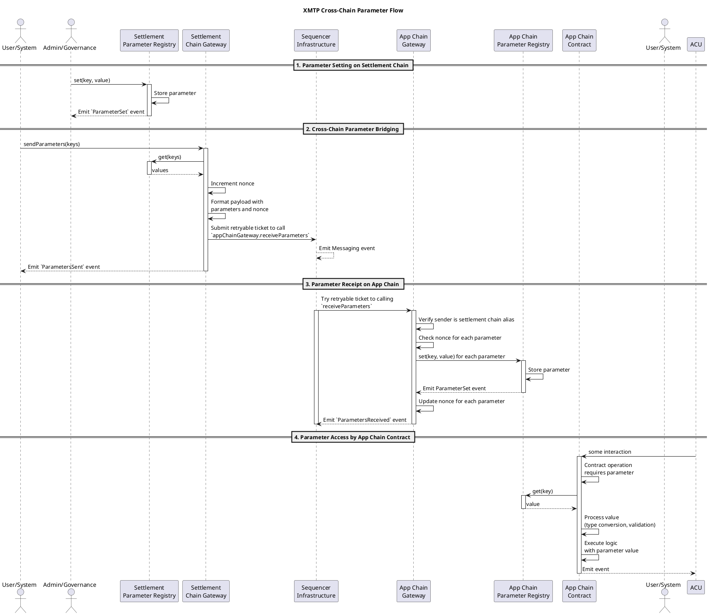
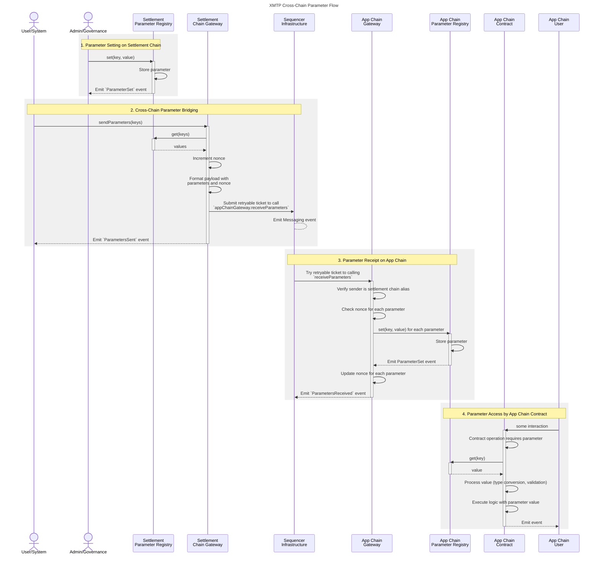

# XMTP parameter flow - sequence diagrams

This document illustrates the complete process of setting a parameter in the XMTP Settlement Chain parameter registry and its journey to being fetched by a contract on an XMTP App Chain.

## PlantUML version

## Mermaid version

## Explanation of parameter flow steps

1. To set a parameter, on the Settlement Chain:

   - Admin/governance calls `set(key, value)` on Parameter Registry
   - The registry stores the parameter and emits an event

2. To bridge parameters to the app chain, on the Settlement Chain:

   - any User/system calls `sendParameters(keys)` on the Gateway
   - This begins the cross-chain bridging process
   - Gateway retrieves current parameter values from Parameter Registry
   - Gateway tracks nonce to ensure ordered parameter updates
   - Gateway formats payload containing parameters and nonce
   - Gateway submits a retryable ticket to the "Sequencer Infrastructure" (inbox, then bridge)

3. To receive parameters on the App Chain, on the App Chain:

   - Sequencer Infrastructure submit the retryable ticket and tries the call and calldata once
   - Gateway verifies sender is the Settlement Chain Gateway alias
   - Gateway checks nonce for each parameter to prevent replay/out-of-order updates
   - Gateway sets parameters in Parameter Registry
   - Gateway updates nonce tracking for each parameter

4. To access a parameter, on the App Chain:
   - Some call is made to an app chain contract
   - During operation, if the contract needs to access a parameter, it calls `get(key)` on Parameter Registry
   - Contract converts and validates the bytes32 value to the appropriate type
   - Contract executes logic using the parameter value

This sequence demonstrates the complete lifecycle of a parameter from its initial setting on the XMTP Settlement Chain to its eventual use by a contract on the XMTP App Chain, highlighting the cross-chain bridging mechanism using retryable tickets.
