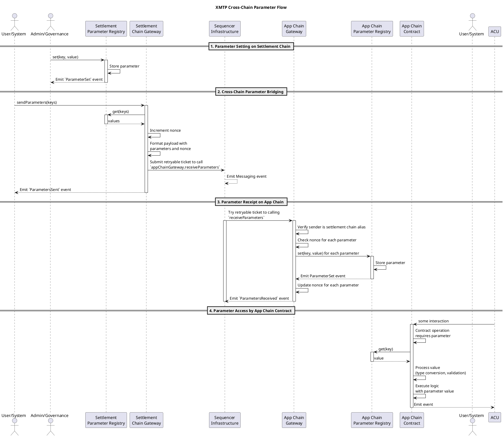
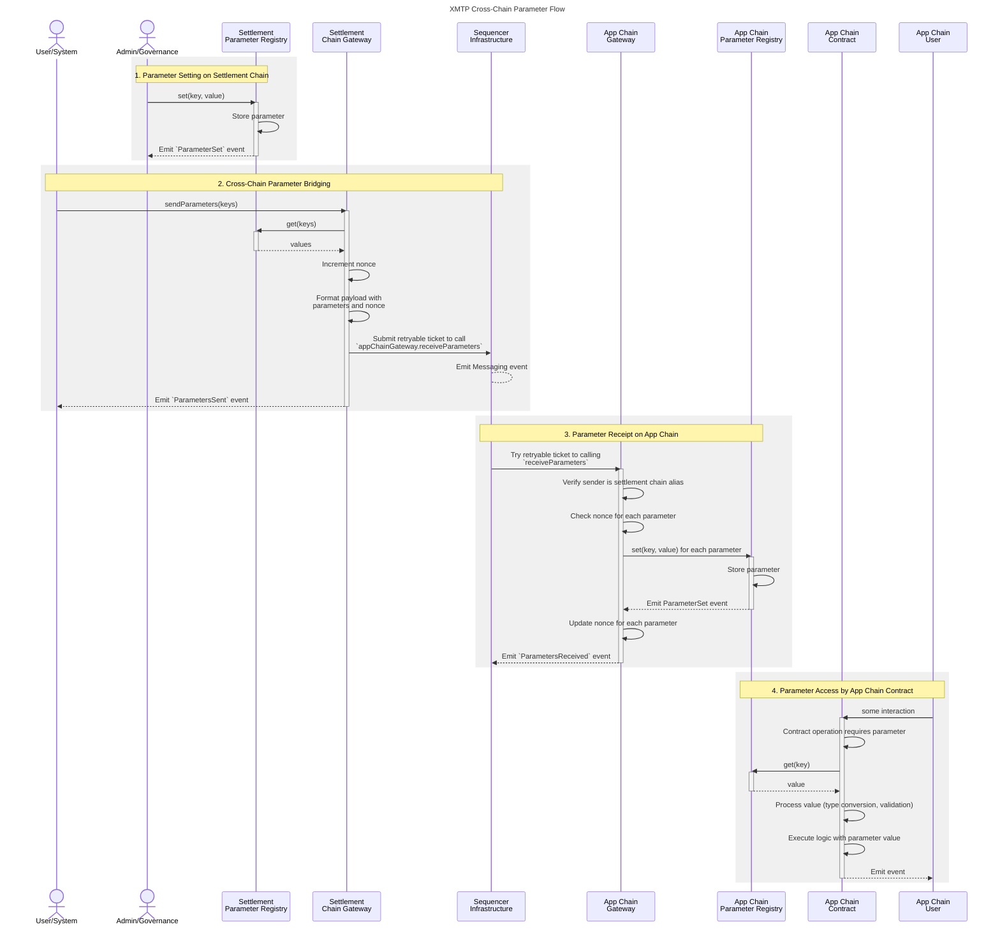

# XMTP network contracts - Parameter registry

- [XMTP network contracts - Parameter registry](#xmtp-network-contracts---parameter-registry)
  - [Available Configuration](#available-configuration)
    - [Settlement Chain Parameters](#settlement-chain-parameters)
      - [Settlement Chain Parameter Registry](#settlement-chain-parameter-registry)
      - [Fee Token](#fee-token)
      - [Node Registry](#node-registry)
      - [Payer Registry](#payer-registry)
      - [Payer Report Manager](#payer-report-manager)
      - [Distribution Manager](#distribution-manager)
      - [Rate Registry](#rate-registry)
      - [Settlement Chain Gateway](#settlement-chain-gateway)
      - [Factory (Any Chain)](#factory-any-chain)
    - [App Chain Parameters](#app-chain-parameters)
      - [App Chain Parameter Registry](#app-chain-parameter-registry)
      - [App Chain Gateway](#app-chain-gateway)
      - [Group Message Broadcaster](#group-message-broadcaster)
      - [Identity Update Broadcaster](#identity-update-broadcaster)
    - [Parameter Types and Validation](#parameter-types-and-validation)
  - [PlantUML version](#plantuml-version)
  - [Mermaid version](#mermaid-version)
  - [Explanation of parameter flow steps](#explanation-of-parameter-flow-steps)

This document illustrates the complete process of setting a parameter in the XMTP Settlement Chain parameter registry and its journey to being fetched by a contract on an XMTP App Chain.

## Available Configuration

The XMTP protocol uses a comprehensive parameter system to manage configuration across all contracts. Parameters are organized by contract and functionality, using a hierarchical key structure. All parameter keys follow the pattern `xmtp.{contract}.{parameter}`.

### Settlement Chain Parameters

#### Settlement Chain Parameter Registry

- **`xmtp.settlementChainParameterRegistry.migrator`**: Address of the migrator contract for upgrades
- **`xmtp.settlementChainParameterRegistry.isAdmin.{address}`**: Admin status for specific addresses. Note: addresses are always lowercase.

#### Fee Token

- **`xmtp.feeToken.migrator`**: Address of the migrator contract for upgrades

#### Node Registry

- **`xmtp.nodeRegistry.admin`**: Administrator address for node management
- **`xmtp.nodeRegistry.maxCanonicalNodes`**: Maximum number of canonical nodes allowed
- **`xmtp.nodeRegistry.migrator`**: Address of the migrator contract for upgrades

#### Payer Registry

- **`xmtp.payerRegistry.settler`**: Address authorized to settle usage fees
- **`xmtp.payerRegistry.feeDistributor`**: Address of the fee distribution contract
- **`xmtp.payerRegistry.minimumDeposit`**: Minimum deposit amount required for payers
- **`xmtp.payerRegistry.withdrawLockPeriod`**: Time lock period for withdrawals (in seconds)
- **`xmtp.payerRegistry.paused`**: Pause status for payer operations
- **`xmtp.payerRegistry.migrator`**: Address of the migrator contract for upgrades

#### Payer Report Manager

- **`xmtp.payerReportManager.migrator`**: Address of the migrator contract for upgrades
- **`xmtp.payerReportManager.protocolFeeRate`**: Protocol fee rate in basis points (0-10000)

#### Distribution Manager

- **`xmtp.distributionManager.migrator`**: Address of the migrator contract for upgrades
- **`xmtp.distributionManager.paused`**: Pause status for distribution operations
- **`xmtp.distributionManager.protocolFeesRecipient`**: Address receiving protocol fees

#### Rate Registry

- **`xmtp.rateRegistry.messageFee`**: Fee per message in protocol units
- **`xmtp.rateRegistry.storageFee`**: Fee per storage unit in protocol units
- **`xmtp.rateRegistry.congestionFee`**: Additional fee during network congestion
- **`xmtp.rateRegistry.targetRatePerMinute`**: Target processing rate per minute
- **`xmtp.rateRegistry.migrator`**: Address of the migrator contract for upgrades

#### Settlement Chain Gateway

- **`xmtp.settlementChainGateway.inbox.{chainId}`**: Inbox address for specific chain ID
- **`xmtp.settlementChainGateway.migrator`**: Address of the migrator contract for upgrades
- **`xmtp.settlementChainGateway.paused`**: Pause status for gateway operations

#### Factory (Any Chain)

- **`xmtp.factory.paused`**: Pause status for contract deployment
- **`xmtp.factory.migrator`**: Address of the migrator contract for upgrades

### App Chain Parameters

#### App Chain Parameter Registry

- **`xmtp.appChainParameterRegistry.migrator`**: Address of the migrator contract for upgrades
- **`xmtp.appChainParameterRegistry.isAdmin.{address}`**: Admin status for specific addresses

#### App Chain Gateway

- **`xmtp.appChainGateway.migrator`**: Address of the migrator contract for upgrades
- **`xmtp.appChainGateway.paused`**: Pause status for gateway operations

#### Group Message Broadcaster

- **`xmtp.groupMessageBroadcaster.minPayloadSize`**: Minimum allowed message payload size
- **`xmtp.groupMessageBroadcaster.maxPayloadSize`**: Maximum allowed message payload size
- **`xmtp.groupMessageBroadcaster.migrator`**: Address of the migrator contract for upgrades
- **`xmtp.groupMessageBroadcaster.paused`**: Pause status for message broadcasting
- **`xmtp.groupMessageBroadcaster.payloadBootstrapper`**: Address authorized to bootstrap messages

#### Identity Update Broadcaster

- **`xmtp.identityUpdateBroadcaster.minPayloadSize`**: Minimum allowed identity update payload size
- **`xmtp.identityUpdateBroadcaster.maxPayloadSize`**: Maximum allowed identity update payload size
- **`xmtp.identityUpdateBroadcaster.migrator`**: Address of the migrator contract for upgrades
- **`xmtp.identityUpdateBroadcaster.paused`**: Pause status for identity update broadcasting
- **`xmtp.identityUpdateBroadcaster.payloadBootstrapper`**: Address authorized to bootstrap identity updates

### Parameter Types and Validation

Parameters are stored as `bytes32` values but represent different data types:

- **Addresses**: Stored as `uint160` cast to `bytes32`
- **Booleans**: `0` for false, `1` for true
- **Integers**: Various unsigned integer types (`uint8`, `uint16`, `uint32`, `uint64`, `uint96`)
- **Strings**: Hash of the string content for non-value types

## PlantUML version

## Mermaid version

## Explanation of parameter flow steps

1. To set a parameter, on the Settlement Chain:

   - Admin/governance calls `set(key, value)` on Parameter Registry
   - The registry stores the parameter and emits an event

2. To bridge parameters to the app chain, on the Settlement Chain:

   - any User/system calls `sendParameters(keys)` on the Gateway
   - This begins the cross-chain bridging process
   - Gateway retrieves current parameter values from Parameter Registry
   - Gateway tracks nonce to ensure ordered parameter updates
   - Gateway formats payload containing parameters and nonce
   - Gateway submits a retryable ticket to the "Sequencer Infrastructure" (inbox, then bridge)

3. To receive parameters on the App Chain, on the App Chain:

   - Sequencer Infrastructure submit the retryable ticket and tries the call and calldata once
   - Gateway verifies sender is the Settlement Chain Gateway alias
   - Gateway checks nonce for each parameter to prevent replay/out-of-order updates
   - Gateway sets parameters in Parameter Registry
   - Gateway updates nonce tracking for each parameter

4. To access a parameter, on the App Chain:
   - Some call is made to an app chain contract
   - During operation, if the contract needs to access a parameter, it calls `get(key)` on Parameter Registry
   - Contract converts and validates the bytes32 value to the appropriate type
   - Contract executes logic using the parameter value

This sequence demonstrates the complete lifecycle of a parameter from its initial setting on the XMTP Settlement Chain to its eventual use by a contract on the XMTP App Chain, highlighting the cross-chain bridging mechanism using retryable tickets.
