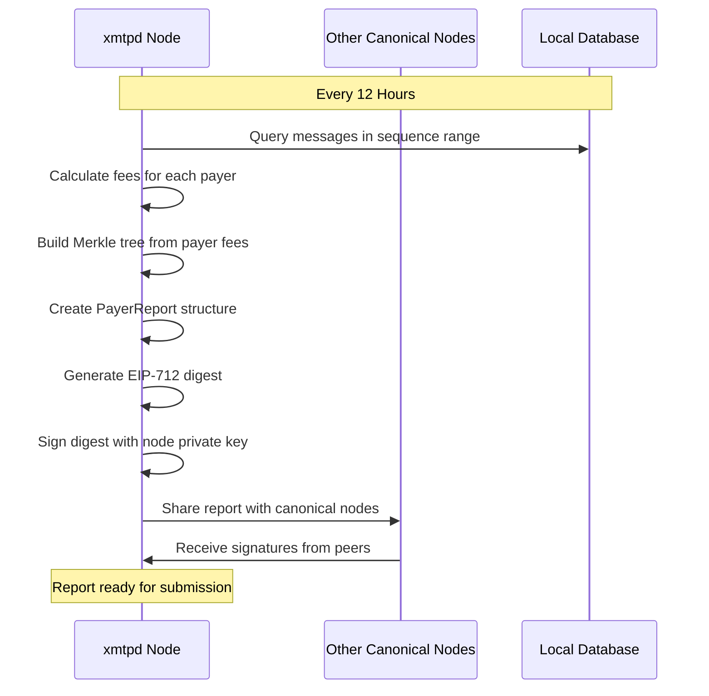
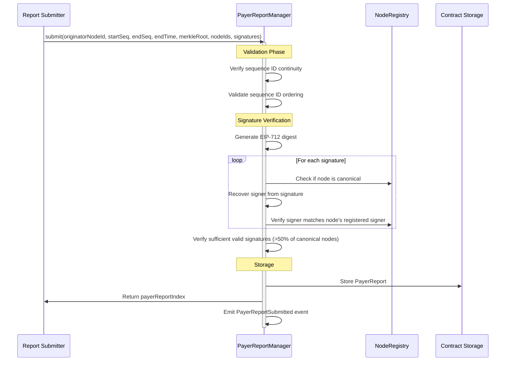
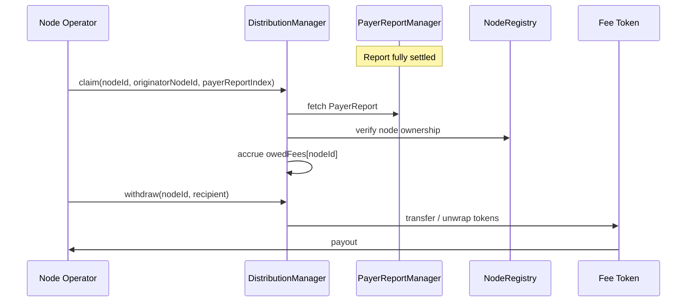

# XMTP network economic model - Payer reports

- [XMTP network economic model - Payer reports](#xmtp-network-economic-model---payer-reports)
  - [PayerReport structure](#payerreport-structure)
    - [Field descriptions](#field-descriptions)
  - [EIP-712 signature hash](#eip-712-signature-hash)
  - [Merkle tree structure](#merkle-tree-structure)
  - [Report lifecycle](#report-lifecycle)
    - [1. Report generation (offchain)](#1-report-generation-offchain)
    - [2. Attestation and signing](#2-attestation-and-signing)
    - [3. Report submission](#3-report-submission)
    - [4. Settlement process](#4-settlement-process)
  - [Key features](#key-features)
    - [Sequential processing](#sequential-processing)
    - [Consensus mechanism](#consensus-mechanism)
    - [Economic integration](#economic-integration)
    - [Partial settlement support](#partial-settlement-support)
  - [Error handling](#error-handling)


As described in the [architecture](./architecture.md) document, the MLS standard defines multiple message types. In the XMTP network:
- Two MLS message types are published directly onchain, and payers interacting through the Gateway service pay gas costs directly.
- Three MLS message types are published offchain to xmtpd nodes via APIs.

For the offchain message types, _fees are accounted for and settled asynchronously_. 
Each xmtpd node tracks all billable messages it processes and periodically produces a cryptographically verifiable accounting artifact called a **PayerReport**.

Payer reports are the backbone of the XMTP network’s economic model: they reconcile offchain usage with onchain balances, ensure consensus among nodes, and ultimately drive node operator payouts.

Payer reports are managed onchain by the `PayerReportManager` contract and interact with the `PayerRegistry` and `DistributionManager` contracts during settlement and distribution.

## PayerReport structure

A complete `PayerReport` contains the following fields:

```json
{
  "originatorNodeId": 100,
  "startSequenceId": 0,
  "endSequenceId": 1000,
  "endMinuteSinceEpoch": 12345678,
  "feesSettled": 0,
  "offset": 0,
  "isSettled": false,
  "protocolFeeRate": 100,
  "payersMerkleRoot": "0x12345678abcdef...",
  "nodeIds": [100, 200, 300]
}
```
> **Important**: The exact field order and types are part of the onchain ABI contract. Any mismatch between offchain code, interfaces, or consuming contracts will result in incorrect decoding and may cause settlement or distribution to fail.

### Field descriptions

- **`originatorNodeId`**: ID of the node that originated this report (NFT ID from NodeRegistry)
- **`startSequenceId`**: Starting sequence number for messages in this report
- **`endSequenceId`**: Ending sequence number for messages in this report
- **`endMinuteSinceEpoch`**: Timestamp marking the end of the reporting period
- **`feesSettled`**: Total fees already settled from this report (starts at 0)
- **`offset`**: Next index in the Merkle tree to be processed (for partial settlements)
- **`isSettled`**: Whether the entire report has been processed
- **`protocolFeeRate`**: Protocol fee percentage (in basis points) at time of submission
- **`payersMerkleRoot`**: Merkle tree root containing all payer fee data
- **`nodeIds`**: List of active canonical nodes during the reporting period

## EIP-712 signature hash

The report hash for signing is calculated using [EIP-712](https://eips.ethereum.org/EIPS/eip-712) structured data hashing:

**Type hash:**

```solidity
keccak256("PayerReport(uint32 originatorNodeId,uint64 startSequenceId,uint64 endSequenceId,uint32 endMinuteSinceEpoch,bytes32 payersMerkleRoot,uint32[] nodeIds)")
```

**Final digest:**

```solidity
keccak256(
  abi.encodePacked(
    "\x19\x01",
    DOMAIN_SEPARATOR,
    keccak256(abi.encode(PAYER_REPORT_TYPEHASH, ...report_data))
  )
)
```

The domain separator is defined by the [ERC5267](../src/abstract/ERC5267.sol) implementation.

## Merkle tree structure

The `payersMerkleRoot` is computed offchain using a specialized [merkle package](https://github.com/xmtp/xmtpd/tree/main/pkg/merkle) in `xmtpd`.

Each leaf in the Merkle tree contains:

```yaml
payer_address: owed_amount
```

The tree supports sequential proofs, allowing for partial settlement of reports in batches rather than requiring full settlement in a single transaction.

## Report lifecycle

### 1. Report generation (offchain)



### 2. Attestation and signing

Before submission, PayerReports must be signed by a majority of canonical nodes:

#### Signature requirements:

- Must have signatures from `(canonicalNodeCount / 2) + 1` nodes
- Only signatures from canonical nodes are valid
- Signing node IDs must be **ordered and unique**
- Each signature is verified against the node's registered signer address

#### Signature structure:

```solidity
struct PayerReportSignature {
  uint32 nodeId; // Node ID from NodeRegistry
  bytes signature; // ECDSA signature of the report digest
}
```

### 3. Report submission
Once sufficient signatures are collected, the report is submitted onchain:



Submission locks in:
- The reporting window
- The protocol fee rate
- The canonical node set

### 4. Settlement process

Settlement converts the Merkle-committed payer fees into actual balance deductions:


Settlement may occur in multiple batches.

When all leaves are processed, isSettled is set to true.

## Node Payout
Node payouts are the final step in the XMTP economic lifecycle, converting **settled payer fees** into rewards for node operators.
This process is fully onchain, deterministic, and pull-based: node operators must explicitly claim and withdraw their rewards.

Payouts are managed by the DistributionManager  contract and are strictly gated by:
- report settlement status,
- node participation in the report, and
- node ownership via the NodeRegistry.

### Overview

At a high level, node payouts follow this flow:



### Preconditions for payout

A node cannot receive fees unless all of the following are true:
1. The payer report is fully settled
- PayerReport.isSettled == true
- Partial settlements do not enable payouts.
2. The node participated in the reporting period
- nodeId must be present in PayerReport.nodeIds.
3. The caller owns the node
- Ownership is verified via NodeRegistry.ownerOf(nodeId).
4. The report has not already been claimed by this node
- Claims are tracked per (nodeId, originatorNodeId, payerReportIndex).

### Claiming fees

Once the above conditions are met, a node operator may claim their share of a settled report:
```solidity
claim(
uint32 nodeId,
uint32[] originatorNodeIds,
uint256[] payerReportIndices
) returns (uint96 claimed)
```

What claim does? For each (originatorNodeId, payerReportIndex) pair:
- Fetches the PayerReport from PayerReportManager
- Verifies isSettled == true
- Verifies nodeId ∈ nodeIds
- Verifies the claim has not already occurred
- Computes the protocol fee
- Computes the node’s equal share of remaining fees
- Accrues the result to owedFees\[nodeId\]

> **Important**: claim does not transfer tokens.
It only records an accounting entry inside DistributionManager.

### Withdrawing fees

After claiming, node operators must explicitly withdraw their accrued balance:
```solidity
withdraw(uint32 nodeId, address recipient) returns (uint96 withdrawn)
withdrawIntoUnderlying(uint32 nodeId, address recipient) returns (uint96 withdrawn)
```

Withdrawal behavior
- Only the node owner may withdraw.
- Withdrawals are capped by the contract’s available balance.
- If insufficient funds are present:
  - DistributionManager pulls excess funds from PayerRegistry.
- Withdrawals reduce:
  - owedFees\[nodeId\]
  - totalOwedFees
- A withdrawal reverts with `NoFeesOwed()` if the node has not successfully claimed any reports.

### Protocol fees

Protocol fees are handled separately from node rewards:
- Protocol fees are accrued during settlement.
- Anyone may trigger:
```solidity
claimProtocolFees(...)
withdrawProtocolFees()
withdrawProtocolFeesIntoUnderlying()
```
- Funds are sent to the configured `protocolFeesRecipient`.

Protocol fees are **not** claimable by nodes and are not included in owedFees.

## Key features

### Sequential processing

- Reports must be submitted with continuous sequence IDs (no gaps)
- Each originator node maintains its own sequence of reports
- Settlement can occur in batches using sequential Merkle proofs

### Consensus mechanism

- Requires majority consensus from canonical nodes (>50%)
- Invalid signatures are ignored, not rejected
- Signature verification uses ECDSA recovery and node registry validation

### Economic integration

- Protocol fee rate is captured at submission time
- Fees are settled directly from payer balances in PayerRegistry
- Settled fees are transferred to DistributionManager for node operator rewards

### Partial settlement support

- Large reports can be settled in multiple transactions
- Offset tracking ensures sequential processing of Merkle tree leaves
- Settlement completion is automatically detected and marked

## Error handling

The system includes comprehensive error handling for various failure scenarios:

- **Invalid sequence IDs**: Reports with gaps or incorrect ordering are rejected
- **Insufficient signatures**: Reports without majority consensus are rejected
- **Invalid signatures**: Signatures from non-canonical nodes or with incorrect recovery are ignored
- **Settlement failures**: Failed settlement calls to PayerRegistry are reverted with detailed error information
- **Merkle proof failures**: Invalid proofs or out-of-order settlements are rejected

This robust error handling ensures the integrity of the economic settlement process while providing clear feedback for debugging and recovery.
