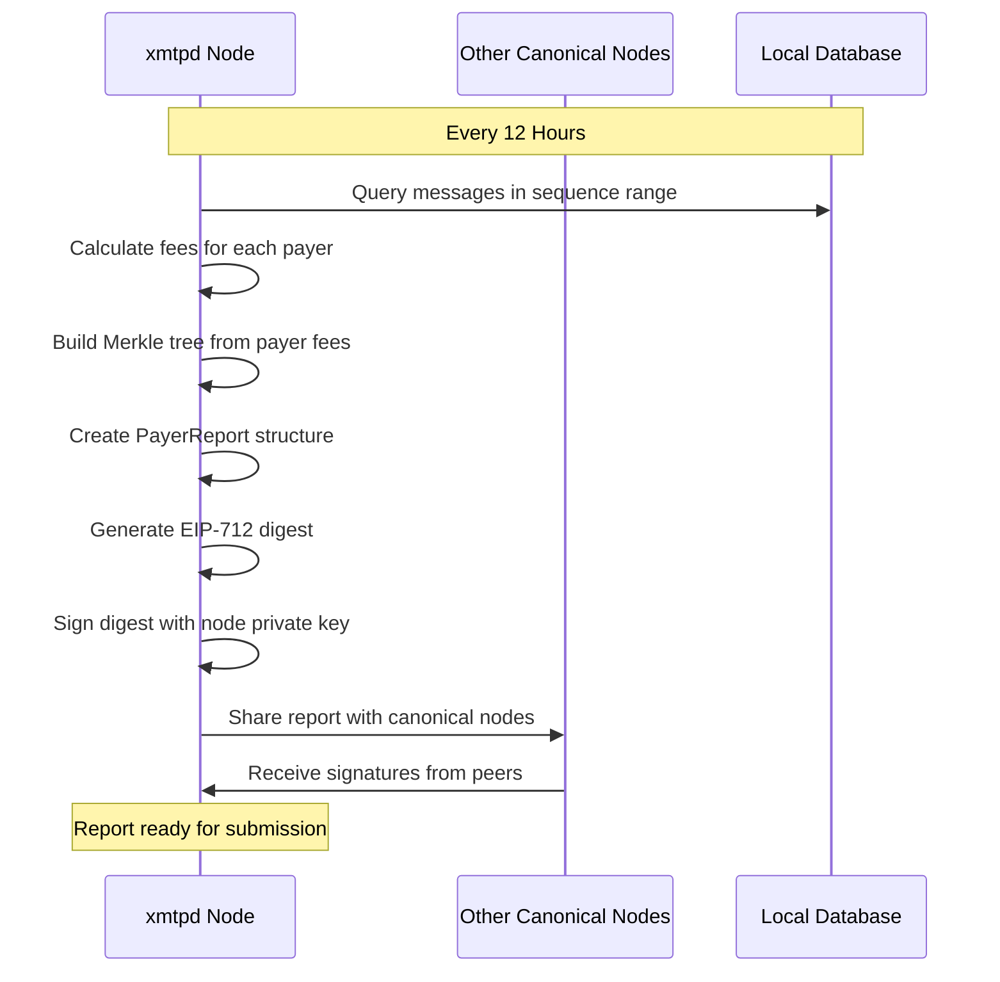
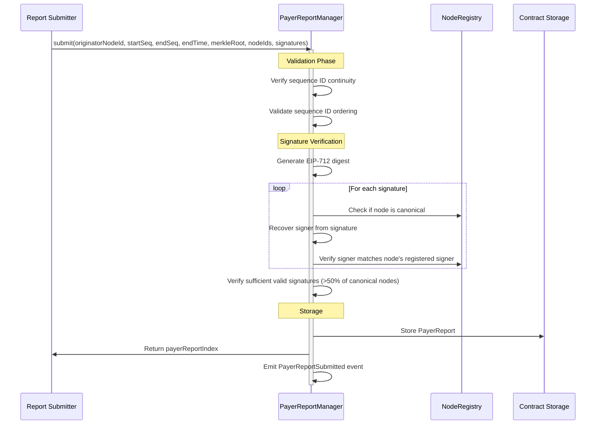
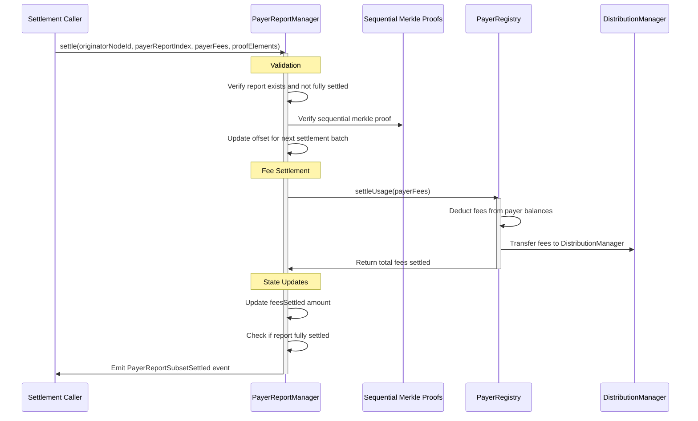

# Payer Reports

As described in the [architecture](./architecture.md) document, the MLS standard defines multiple message types. In the XMTP network, 2 of those types are directly published to the blockchain, and payers through the `Gateway` service pay directly for the gas used to publish them.

The other 3 types of messages are published to `xmtpd` nodes through off-chain APIs, and each `xmtpd` node tracks all the messages published through them and creates a detailed report every 12 hours. This is called a `PayerReport`, and it's essential to the economic model and sustainability of the network. These reports are managed through the [PayerReportManager contract](../src/settlement-chain/PayerReportManager.sol).

## PayerReport Structure

A complete `PayerReport` contains the following fields:

```json
{
  "originatorNodeId": 100,
  "startSequenceId": 0,
  "endSequenceId": 1000,
  "endMinuteSinceEpoch": 12345678,
  "feesSettled": 0,
  "offset": 0,
  "isSettled": false,
  "protocolFeeRate": 100,
  "payersMerkleRoot": "0x12345678abcdef...",
  "nodeIds": [100, 200, 300]
}
```

### Field Descriptions

- **`originatorNodeId`**: The ID of the node that originated this report (NFT ID from NodeRegistry)
- **`startSequenceId`**: The starting sequence number for messages in this report
- **`endSequenceId`**: The ending sequence number for messages in this report
- **`endMinuteSinceEpoch`**: Timestamp marking the end of the reporting period
- **`feesSettled`**: Total fees already settled from this report (starts at 0)
- **`offset`**: Next index in the Merkle tree to be processed (for partial settlements)
- **`isSettled`**: Whether the entire report has been processed
- **`protocolFeeRate`**: Protocol fee percentage (in basis points) at time of submission
- **`payersMerkleRoot`**: Merkle tree root containing all payer fee data
- **`nodeIds`**: List of active canonical nodes during the reporting period

## EIP-712 Signature Hash

The report hash for signing is calculated using [EIP-712](https://eips.ethereum.org/EIPS/eip-712) structured data hashing:

**Type Hash:**

```solidity
keccak256("PayerReport(uint32 originatorNodeId,uint64 startSequenceId,uint64 endSequenceId,uint32 endMinuteSinceEpoch,bytes32 payersMerkleRoot,uint32[] nodeIds)")
```

**Final Digest:**

```solidity
keccak256(
  abi.encodePacked(
    "\x19\x01",
    DOMAIN_SEPARATOR,
    keccak256(abi.encode(PAYER_REPORT_TYPEHASH, ...report_data))
  )
)
```

The domain separator is defined by the [ERC5267](../src/abstract/ERC5267.sol) implementation.

## Merkle Tree Structure

The `payersMerkleRoot` is computed off-chain using a specialized [merkle package](https://github.com/xmtp/xmtpd/tree/main/pkg/merkle) in `xmtpd`.

Each leaf in the Merkle tree contains:

```yaml
payer_address: owed_amount
```

The tree supports sequential proofs, allowing for partial settlement of reports in batches rather than requiring full settlement in a single transaction.

## Report Lifecycle

### 1. Report Generation (Off-chain)



### 2. Attestation and Signing

Before submission, PayerReports must be signed by a majority of canonical nodes:

**Signature Requirements:**

- Must have signatures from `(canonicalNodeCount / 2) + 1` nodes
- Only signatures from canonical nodes are valid
- Signing node IDs must be ordered and unique
- Each signature is verified against the node's registered signer address

**Signature Structure:**

```solidity
struct PayerReportSignature {
  uint32 nodeId; // Node ID from NodeRegistry
  bytes signature; // ECDSA signature of the report digest
}
```

### 3. Report Submission



### 4. Settlement Process

Settlement can occur in batches, allowing large reports to be processed incrementally:



## Key Features

### Sequential Processing

- Reports must be submitted with continuous sequence IDs (no gaps)
- Each originator node maintains its own sequence of reports
- Settlement can occur in batches using sequential Merkle proofs

### Consensus Mechanism

- Requires majority consensus from canonical nodes (>50%)
- Invalid signatures are ignored, not rejected
- Signature verification uses ECDSA recovery and node registry validation

### Economic Integration

- Protocol fee rate is captured at submission time
- Fees are settled directly from payer balances in PayerRegistry
- Settled fees are transferred to DistributionManager for node operator rewards

### Partial Settlement Support

- Large reports can be settled in multiple transactions
- Offset tracking ensures sequential processing of Merkle tree leaves
- Settlement completion is automatically detected and marked

## Error Handling

The system includes comprehensive error handling for various failure scenarios:

- **Invalid Sequence IDs**: Reports with gaps or incorrect ordering are rejected
- **Insufficient Signatures**: Reports without majority consensus are rejected
- **Invalid Signatures**: Signatures from non-canonical nodes or with incorrect recovery are ignored
- **Settlement Failures**: Failed settlement calls to PayerRegistry are reverted with detailed error information
- **Merkle Proof Failures**: Invalid proofs or out-of-order settlements are rejected

This robust error handling ensures the integrity of the economic settlement process while providing clear feedback for debugging and recovery.
