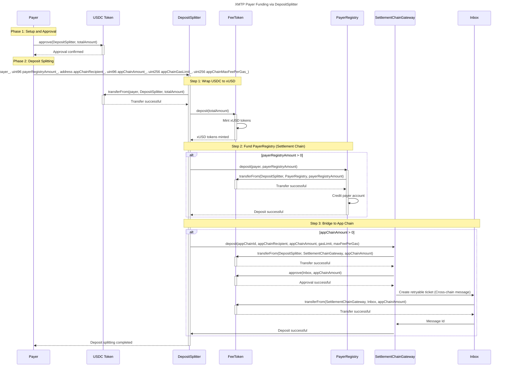

# Payers

Payers are entities (typically app developers, agents, or service providers) who need to fund their accounts to pay for XMTP network services such as message broadcasting and identity updates. The XMTP protocol provides multiple funding mechanisms to accommodate different user preferences and technical capabilities.

## Funding Methods

### Manual Funding Process

The traditional manual funding process involves multiple steps across both settlement and application chains:

1. **Wallet Setup**: Create wallets on both the settlement chain (Base L2) and application chain (XMTP L3)
2. **Token Wrapping**: Deposit USDC into the `FeeToken` contract, receiving `xUSD` tokens in exchange at a 1:1 ratio
   - This can be skipped if the payer uses the `Underlying`-suffixed functions throughout the protocol.
3. **Settlement Chain Funding**: Deposit `xUSD` tokens into the `PayerRegistry` to cover costs for off-chain message processing and settlement operations
4. **Application Chain Funding**: Transfer `xUSD` tokens to the application chain payer's wallet to cover gas costs for publishing blockchain messages and identity updates

### Simplified Funding with DepositSplitter

For improved user experience, the `DepositSplitter` contract provides convenience functions that streamline the funding process:

- **`deposit()`**: Allows payers to split deposits of `xUSD` between the `PayerRegistry` and `SettlementChainGateway` (to be bridged to an app chain) in a single transaction, assuming they have approved the `DepositSplitter` to spend their `xUSD` tokens.
- **`depositWithPermit()`**: Allows payers to perform the above split `deposit()` without having to precede the transaction with an approval transaction.
- **`depositFromUnderlying()`**: Allows payers to deposit underlying fee tokens (i.e. `USDC`) into the `PayerRegistry` and `SettlementChainGateway` (to be bridged to an app chain) in a single transaction, assuming they have approved the `DepositSplitter` to spend their underlying fee tokens.
- **`depositFromUnderlyingWithPermit()`**: Allows payers to perform the above split `depositFromUnderlying()` without having to precede the transaction with an approval transaction.

This approach reduces the complexity from multiple transactions across different contracts to a single, atomic operation.

### Funding Portal Integration

The Funding Portal provides a user-friendly interface that:

- Simplifies the funding process through an intuitive web interface
- Allows payers to connect their wallets directly using standard wallet connection protocols
- Abstracts away the technical complexity of cross-chain operations
- Provides real-time balance tracking across both settlement and application chains

## DepositSplitter Workflow

The following diagram illustrates the complete process of a payer using the DepositSplitter contract to fund their accounts across both chains, sourced from `USDC`:

