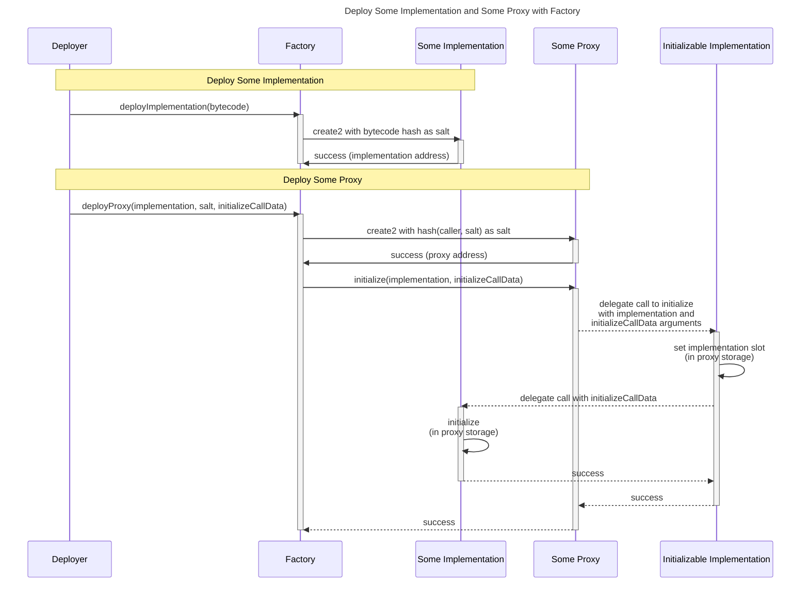
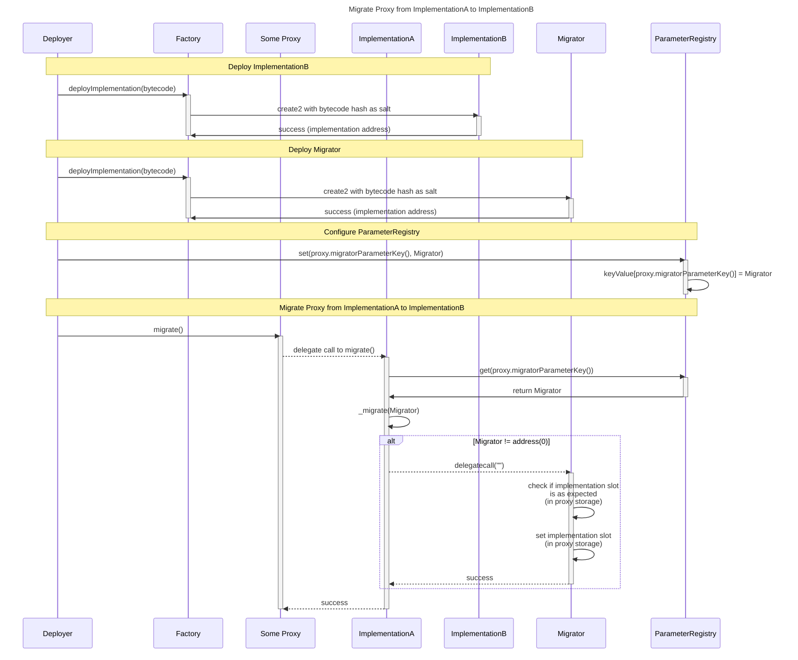

# XMTP network contracts - Proxy, factory, and migration patterns

- [XMTP network contracts - Proxy, factory, and migration patterns](#xmtp-network-contracts---proxy-factory-and-migration-patterns)
  - [Proxy pattern](#proxy-pattern)
  - [Factory pattern](#factory-pattern)
  - [Migration pattern](#migration-pattern)

## Proxy pattern

All contracts in the system are either implementations that are to be proxied or proxies to an implementation, except for the `DepositSplitter` (as it is stateless).

The `Proxy` contract is a minimal transparent proxy with an initial implementation and using the standard `ERC1967` storage slot. Since constructor arguments are part of the bytecode and affect the `create2` address, constructor arguments must be consistent to keep proxy deployments predictable, regardless of the implementation that will _inevitably be expected_ to be proxied.

## Factory pattern

The `Factory` contract is a singleton per chain (not per environment, see [deployment](./deployment.md)) that is used to deploy implementations and proxies with deterministic addresses on all chains. It is designed with the key properties that, when deploying proxies:

1. Any implementation's address is _only_ defined by its bytecode
2. The proxy's address is _only_ defined by the user-provided salt
3. The proxy deployment and initialization are _atomic_
4. The proxy ends up proxying the _intended_ implementation once the transaction is completed

To achieve property 1, via `deployImplementation`, the `Factory` contract uses the `create2` opcode to deploy the provided bytecode for an implementation, where the salt is the bytecode hash.

To achieve property 2, via `deployProxy`, the `Factory` contract uses the `create2` opcode to deploy the constant `Proxy` creation code with an `initializableImplementation` as the constructor argument, where the salt is the hash of the caller and the user-provided salt.

The `initializableImplementation` is a contract that is deployed once by the `Factory` contract (during its own initialization) and is used as the first implementation that proxies will proxy. This ensures that all proxies are deployed deterministically, as their bytecode and constructor arguments are fixed, and only the caller and the salt provided are definable, which allows the caller complete control in planning ahead.

To achieve properties 3 and 4, the `Factory` contract calls `initialize` on the proxy, which is currently proxying the `Initializable` singleton implementation, so the `Initializable` contract's `initialize` function is executed. The `Factory` passes this function the intended implementation address for the proxy, and any initialization arguments that the caller wants to pass to that implementation's `initialize` function. The `Initializable` contract's `initialize` function sets the proxy's implementation slot to the intended implementation address, and then, if needed, delegates the call to the implementation's `initialize` function with the provided initialization arguments. Once all this is done, the proxy will be proxying the intended implementation, and have its storage initialized as defined by the intended implementation.

This process was chosen to minimize intermediate deployments of individual "deploy helper" contracts, as used by other `create3` implementations.

## Migration pattern

To have clear support for decentralized governance, all stateful contracts are expected to be able to be upgradeable/migratable in an exacting way such that:

- a proxy can have its implementation changed, and/or
- a proxy's storage can be manipulated as needed to satisfy a change in the implementation, before or after this change, and/or
- a proxy's storage can be manipulated as needed to correct for anything, without the need to change the implementation
- migration details are defined at build/deploy time, and not at runtime (i.e., no arguments needed at runtime), so that migrations are deterministic and can be voted on by governance

All current implementation contracts implement the `IMigratable` interface, which allows proxies a consistent way to be migrated (i.e., have their storage, including the implementation slot, manipulated). The `migrate()` function defined by the `IMigratable` interface does not take any parameters, and is expected to be called by anyone, at any time, and only succeed if a valid migration is defined and possible, as per the local `ParameterRegistry` contract. Further, all implementation contracts define a `migratorParameterKey` and extend the `Migratable` abstract contract, which defines a `_migrate` function that accepts the address of a `Migrator` contract.

1. The implementation fetches the address of the `Migrator` contract from the `ParameterRegistry` contract, using the unique `migratorParameterKey` for the implementation.
2. It calls `_migrate` with the address of the `Migrator` contract as the only parameter.
3. If this address is not the zero address, the `Migrator` is called with no data, so its fallback code is executed.
4. The `Migrator`'s fallback code can manipulate the proxy's storage, including the implementation slot, as needed to satisfy a migration.
   - The only non-enforceable requirement is that it emit an `IERC1967.Upgraded` event if the implementation slot is changed.
5. The `_migrate` checks that the delegate call to the `Migrator` executed successfully.

Note that it is possible for the new implementation to define entirely new migration logic/patterns, which is outside the scope of this document.

The additional benefits of this mechanism are that individual proxies or implementations are not burdened (in both code size and complexity) by having to define the specific migration logic based on the version of the implementation that is being migrated from. The specific migration code is completely decoupled and compartmentalized in a deployed `Migrator` contract (which can be voted on by governance), which can perform additional checks (i.e., starting implementation slot value) and validations.

A sample `Migrator` contract is provided in the [Migrator.sol](../src/any-chain/Migrator.sol) file, which is deployed by the `Factory` contract via the `deployImplementation` function, where the bytecode is the creation code of the `Migrator` contract with the `fromImplementation` and `toImplementation` as the constructor arguments.

This `Migrator` contract is then used to migrate a proxy whose value at the implementation slot equals `fromImplementation`, and sets the value at the implementation slot to `toImplementation`.

Note that with such a `Migrator` contract, again after a successful migration, calling `migrate()` on the proxy again will fail if the `ParameterRegistry` contract still defines that same `Migrator` as the value of the proxy's implementation's `migratorParameterKey`, since the `fromImplementation` check will fail.

