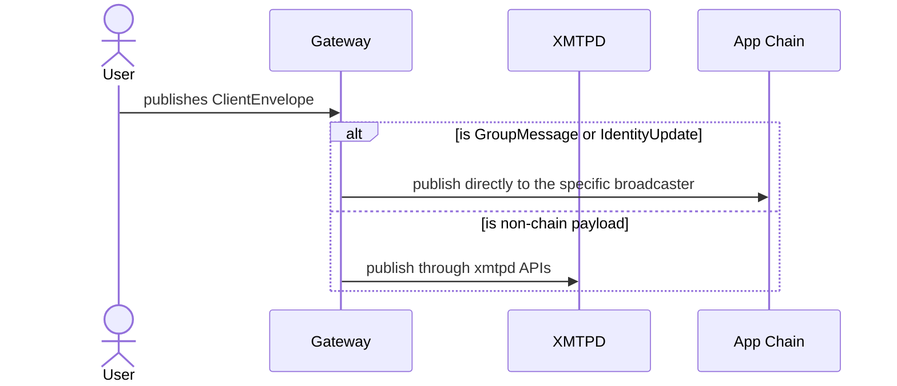

# XMTP Network System Architecture

> Last edited: 09/15/2025

- [XMTP Network System Architecture](#xmtp-network-system-architecture)
  - [Messaging protocol](#messaging-protocol)
  - [Chains](#chains)
  - [Actors](#actors)
    - [Node Operators](#node-operators)
    - [Payers](#payers)
    - [End users](#end-users)

## Messaging protocol

The XMTP Network allows users to read and write [MLS](https://en.wikipedia.org/wiki/Messaging_Layer_Security) messages, enabling instant-messaging applications to use this secure standard on their communications.

The MLS standard defines 5 types of messages and 2 of them are currently stored in the blockchain through the [Broadcaster contracts](../src/abstract/PayloadBroadcaster.sol): **group messages** and **identity updates**.
The rest of messages are published directly to `xmtpd` nodes.

## Chains

The network is composed by two chains. A deeper view of this separation can be read in the [system contracts document](./system-contracts.md):

- **Application chain** is a L3 based on Arbitrum Orbit that stores the [GroupMessageBroadcaster](../src/app-chain/GroupMessageBroadcaster.sol) and the [IdentityUpdateBroadcaster](../src/app-chain/IdentityUpdateBroadcaster.sol) contracts.
- **Settlement chain** where the governance contracts are deployed.

## Actors

### Node Operators

The XMTP Network is powered by a set of trusted **Node Operators** running the [xmtpd](https://github.com/xmtp/xmtpd) service.

`xmtpd` is a Golang daemon that is composed by different services:

- APIs to read and write MLS messages. Used by payers.
- A registry of other `xmtpd` nodes **part of the canonical network**:
  - Each node subscribe to each other canonical node messages, so the system reaches an identical view of the network for every node.
- A cross-chain indexer that listens to:
  - New group messages and identity updates events on the app chain.
  - Payer related events on the settlement chain.

**On-boarding** a Node Operator requires:

- A protocol administrator to mint a NFT in the [NodeRegistry](../src/settlement-chain/NodeRegistry.sol), which allows the Node Operator to instruct the `xmtpd` service to use their specific private key to authenticate into the network.
- The administrator enables a subset of Node Operators NFT to be the canonical XMTP network. This is controlled by the specific functions in `NodeRegistry.sol`.

### Payers

Payers are 3rd parties interested in publishing messages to the network.

In order to do that they set up a [Gateway](https://github.com/xmtp/xmtpd/tree/main/pkg/api/payer) service, configured with their own private key, which allows publishing messages to `xmtpd` nodes from an specific application.

### End users

that read and write messages into the network, by making use of an application.
